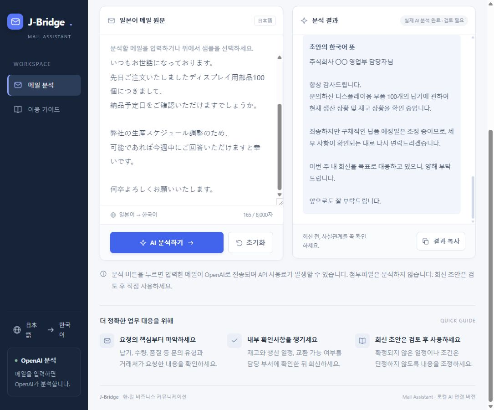

# J-Bridge Mail Assistant

일본어 거래처 메일을 입력하면 OpenAI API를 활용해 요청사항, 긴급도, 내부 확인사항, 회신 전 체크리스트, 일본어 답장 초안을 정리하는 업무 보조 웹앱입니다.

이 프로젝트는 단순한 웹페이지 제작보다, AI를 실제 직무 흐름에 연결해 반복 업무를 줄이는 방법을 보여주기 위해 만들었습니다. 일본 고객/협력사 대응, SCM, 생산관리, 품질관리, 기술지원 CS 업무에서 자주 발생하는 일본어 메일 확인과 회신 준비 과정을 더 빠르고 정확하게 돕는 것을 목표로 합니다.



## 기획 배경

일본 거래처와의 업무 메일에서는 납기 확인, 수량 변경, 품질 이슈, 교환 가능 여부처럼 내부 확인이 필요한 내용이 자주 발생합니다. 신입 담당자는 메일을 읽고 바로 답장하기보다, 먼저 어떤 부서에 무엇을 확인해야 하는지 정리해야 합니다.

J-Bridge Mail Assistant는 이 과정을 다음처럼 도와줍니다.

```text
일본어 메일 입력
→ AI가 요청사항과 긴급도를 정리
→ 내부 확인 부서와 체크리스트 제안
→ 일본어 회신 초안 생성
→ 담당자가 검토 후 직접 회신
```

## 주요 기능

- 일본어 거래처 메일 분석
- 문의 유형 분류
- 거래처 요청사항 요약
- 긴급도와 회신 기한 정리
- 내부 확인 부서 제안
- 회신 전 체크리스트 생성
- 주의해야 할 표현 안내
- 일본어 답장 초안 작성
- 답장 초안의 한국어 뜻 제공

## 직무 연결성

이 프로젝트는 다음 직무 상황을 가정해 만들었습니다.

- 일본 고객/협력사 대응
- 구매 및 외주관리 SCM
- 생산관리 SCM
- 품질관리
- 장비 업체 기술지원 CS
- 글로벌 사업 및 해외사업 지원

특히 일본어 커뮤니케이션 역량과 컴퓨터공학 기반의 도구 제작 경험을 함께 보여주는 포트폴리오로 기획했습니다.

## 사용 예시

예를 들어 일본 거래처가 “디스플레이용 부품 100개의 납품 예정일을 이번 주 안에 알려달라”고 요청하면, 이 웹앱은 다음 내용을 정리합니다.

- 문의 유형: 납기 확인
- 거래처 요청: 부품 수량과 납품 예정일 확인 요청
- 긴급도: 중간
- 회신 기한: 이번 주 중
- 내부 확인 부서: 생산관리, 물류
- 회신 전 체크리스트: 재고, 생산 일정, 출하 가능일, 운송 일정 확인
- 주의할 표현: 확정되지 않은 납기를 단정하지 않기
- 일본어 답장 초안: 정중한 1차 회신 문안

## 기술 구성

- Frontend: HTML, CSS, JavaScript
- Local Backend: Node.js HTTP server
- Deployment Backend: Cloudflare Pages Functions
- AI: OpenAI Responses API
- Runtime: Local server / Cloudflare Pages

API 키는 브라우저에 직접 노출하지 않고, 로컬에서는 `.env` 파일에서, Cloudflare 배포 환경에서는 Variables/Secrets에서만 읽도록 구성했습니다.

## 로컬 실행 방법

1. `.env.example` 파일을 복사해 `.env` 파일을 만듭니다.
2. `.env` 파일에 OpenAI API 키를 입력합니다.

```env
OPENAI_API_KEY=your_api_key_here
OPENAI_MODEL=gpt-4.1-mini
```

3. 아래 명령어로 실행합니다.

```bash
npm start
```

또는 Windows에서는 `start.cmd`를 실행해도 됩니다.

4. 브라우저에서 아래 주소로 접속합니다.

```text
http://127.0.0.1:8787/
```

## Cloudflare Pages 배포 방법

이 프로젝트는 Cloudflare Pages에서도 실행할 수 있도록 `functions/api` 폴더를 포함하고 있습니다.

Cloudflare Pages에 배포할 때는 다음처럼 설정합니다.

```text
Framework preset: None
Build command: 비워두기
Build output directory: .
Root directory: 저장소 루트
```

Cloudflare dashboard의 `Settings > Variables and Secrets`에서 아래 값을 추가합니다.

```text
OPENAI_API_KEY=your_api_key_here
OPENAI_MODEL=gpt-4.1-mini
```

배포 후 웹앱은 Cloudflare Pages가 정적 화면을 제공하고, `/api/analyze` 요청은 Cloudflare Pages Function이 OpenAI API를 호출합니다.

## 주의사항

- `.env` 파일은 GitHub에 올리면 안 됩니다.
- `.dev.vars` 파일도 GitHub에 올리면 안 됩니다.
- 입력한 메일 내용은 분석을 위해 OpenAI API로 전송됩니다.
- AI가 작성한 회신 초안은 실제 발송 전 반드시 사람이 검토해야 합니다.
- 첨부파일 분석 기능은 포함되어 있지 않습니다.

## 향후 개선 방향

- Gmail 임시보관함 저장 기능
- 분석 결과를 CSV 또는 PDF로 저장하는 기능
- 납기, 품질, 수량 변경 등 상황별 프롬프트 고도화
- 배포 환경에서 사용할 수 있는 서버 구조 개선
